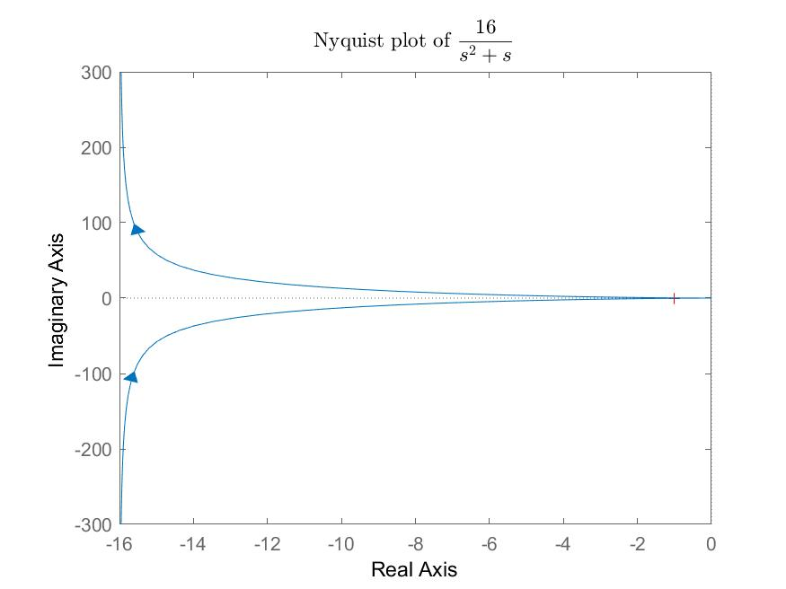

# lab-tac-t3-4
The repository contains two scripts (.m and .mlx). The prior is an ordinary MATLAB script, the former - a live version of the code.
Download the live version (.mlx), change the values of T, k according to your task and you're good to go.

The saved plots are located in the created /plots folder.
(Note that step and impulse response for the simple differentiating function are not plotted due to the function specific)

Plots look like this:

